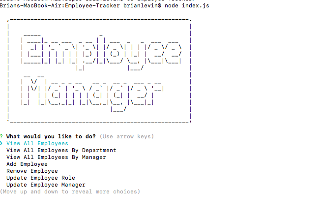
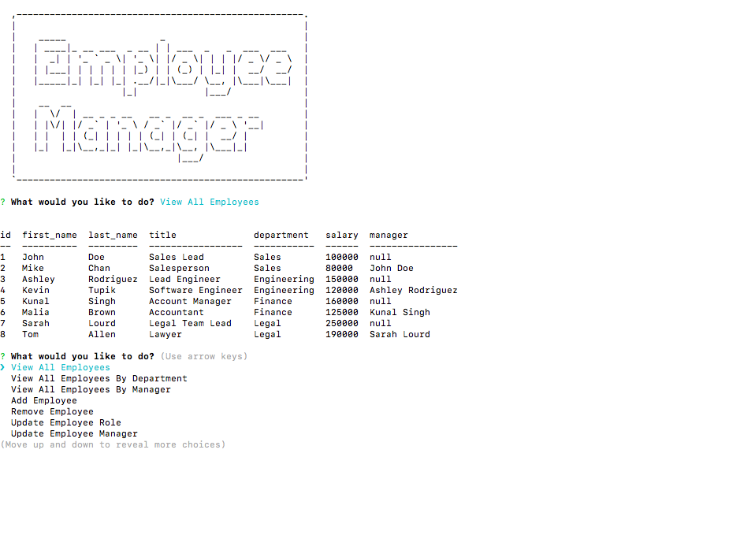
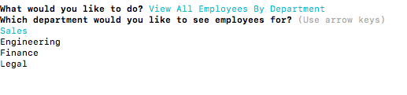
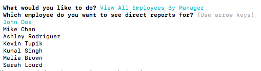
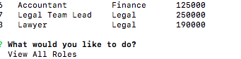

# Employee-Tracker

 ## Description

This is a user interface which allows the user to view and manage an  a work organizations information.  The user can view, add, update, and remove employee and department information.

 ## Click [here](https://drive.google.com/file/d/1x0hwViKycjZYwKrZhp509oGG6UC7XDv5/view?usp=sharing) for the live demonstration of the app.
 
 This is the home screen:
 
 
 This is what it looks like to view all Employees:
 
 
 
 This is what it looks like to view all Employees by department:
 
 
 
 This is the screen to view all employees by manager:
 
  
 
 These are  other selections you can make in the interface:
 
  
 
 These are the last selections you can make in the interface:
 
  
 
## Libraries,framewprks, and syntax:

- MySQL
- Inquirer
- Node 

## email
bml201095@gmail.com

